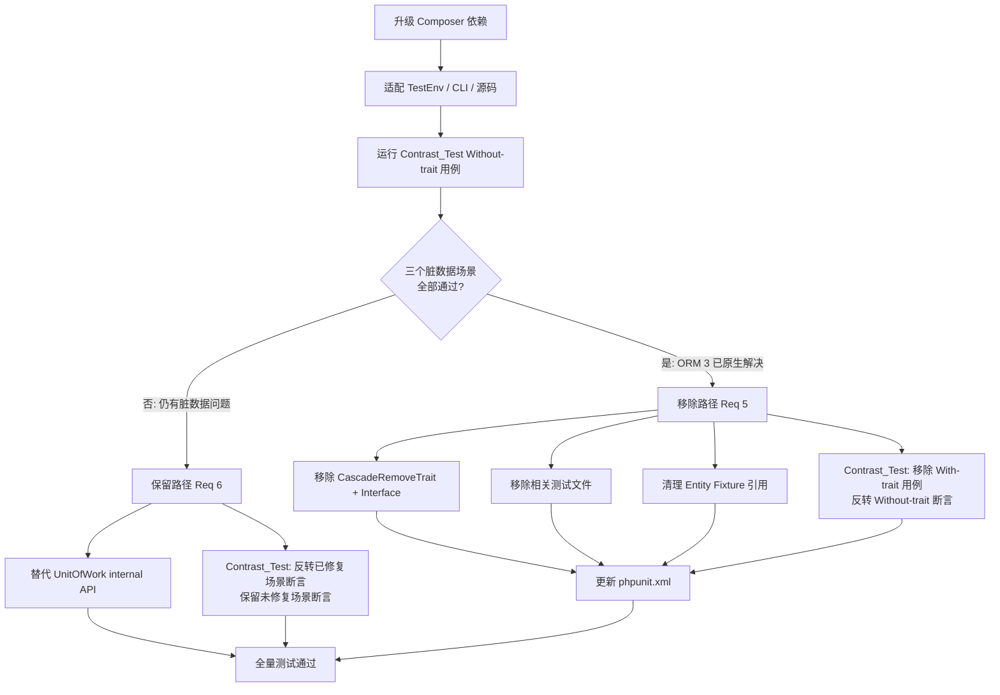

# Design Document

`.kiro/specs/release-3.1/` — Release 3.1 (Doctrine ORM 3 / DBAL 4 Upgrade) 技术设计。

---

## Overview

本设计覆盖 `oasis/doctrine-addon` 从 Doctrine ORM 2.20 + DBAL 3.10 升级到 ORM ^3.6 + DBAL ^4.4 的完整方案，包括：消除 abandoned 间接依赖、验证 ORM 3 是否原生解决 identity map / L2 cache 脏数据问题、根据验证结果处置 CascadeRemoveTrait、消除对 UnitOfWork internal API 的依赖、适配所有 API 变更。

### 变更范围

升级涉及 5 个维度：

1. **Composer 依赖升级**：`doctrine/orm` ^2.20 → ^3.6，`doctrine/dbal` 显式声明 ^4.4，消除 `doctrine/cache` 和 `doctrine/common` 间接依赖
2. **TestEnv 适配**：EntityManager 构造方式、DBAL 4 驱动标识符、SQLite FK 约束确认
3. **CascadeRemoveTrait 处置**：验证 ORM 3 脏数据问题 → 移除路径或保留路径（含 UnitOfWork internal API 替代）
4. **Contrast_Test 断言反转**：根据验证结果更新对照组测试
5. **CLI 配置适配**：`ConsoleRunner::createHelperSet()` → `EntityManagerProvider` 模式

### 研究发现

在设计阶段对 ORM 3 / DBAL 4 源码进行了深入研究，关键发现如下：

| 研究项 | 发现 |
|--------|------|
| EntityManager 构造函数 | ORM 3.6 中 `new EntityManager($conn, $config)` 仍为 public 构造函数，与 ORM 2.20 一致，**无需变更** |
| DBAL 4 SQLite 驱动 | DBAL 4.4 的 `DriverManager::DRIVER_MAP` 同时支持 `pdo_sqlite` 和 `sqlite3`，`pdo_sqlite` 仍有效，**无需变更** |
| TestEnv FK 约束 | 当前 `TestEnv.php` 已包含 `$connection->executeStatement('PRAGMA foreign_keys = ON')`，**FK 约束已启用**（Req 3 AC4 为现有行为确认） |
| UnitOfWork @internal | ORM 3 中 `UnitOfWork` 类标记为 `@internal`，但 `getEntityIdentifier()`、`isScheduledForDelete()`、`isInIdentityMap()` 方法仍存在且签名未变 |
| ClassMetadata public API | `ClassMetadata::getIdentifierValues($entity)` 是 public API，可替代 `UnitOfWork::getEntityIdentifier()` |
| ConsoleRunner 变更 | ORM 3 中 `ConsoleRunner::createHelperSet()` 已移除，改为 `ConsoleRunner::run(EntityManagerProvider)` 模式，需使用 `SingleManagerProvider` |
| ORMSetup 方法 deprecation | ORM 3.5+ 中 `ORMSetup::createAttributeMetadataConfiguration()` 已 deprecated，推荐使用 `ORMSetup::createAttributeMetadataConfig()`；但 ORM 3.6 中旧方法仍可用 |

### 设计决策

| 决策 | 选择 | 理由 |
|------|------|------|
| EntityManager 构造方式 | 保持 `new EntityManager()` | ORM 3.6 构造函数仍为 public，无需变更 |
| SQLite 驱动标识符 | 保持 `pdo_sqlite` | DBAL 4.4 仍支持，无需变更 |
| ORMSetup 方法 | 使用 `createAttributeMetadataConfig()` | 旧方法在 ORM 3.5+ 已 deprecated，`failOnDeprecation=true` 会导致测试失败 |
| `getEntityIdentifier()` 替代 | `ClassMetadata::getIdentifierValues($entity)` | EntityManager public API，不依赖 @internal UnitOfWork |
| `isScheduledForDelete()` 替代 | `!EntityManager::contains($entity)` | 与 `isInIdentityMap()` 合并为单一 `contains()` 判断，详见 Components §3 分析 |
| `isInIdentityMap()` 替代 | `EntityManager::contains($entity)` | public API，语义等价 |
| 设计覆盖两条路径 | 同时设计移除路径和保留路径 | 验证结果在实施阶段才能确定 |

---

## Architecture

### 依赖层变更

```
composer.json 变更:

require:
  doctrine/orm: ^2.20 → ^3.6        # 大版本升级
  doctrine/dbal: (新增显式声明) ^4.4  # 随 ORM 3 拉入，显式声明确保版本

间接依赖变化:
  doctrine/cache: 2.2.0 → 移除       # ORM 3 不再依赖
  doctrine/common: 3.5.0 → 移除      # ORM 3 不再依赖
```

### 处置路径决策树



### 测试结构变更（两条路径）

**移除路径（Req 5）**：

```
ut/Test/
├── AutoIdTraitTest.php              # 保留
├── AutoIdTraitPbtTest.php           # 保留
├── CascadeRemoveContrastTest.php    # 保留，移除 With-trait 用例，反转 Without-trait 断言
├── CascadeRemoveTest.php            # 删除
├── CascadeRemoveTraitTest.php       # 删除
└── CascadeRemoveTraitPbtTest.php    # 删除
```

**保留路径（Req 6）**：

```
ut/Test/
├── AutoIdTraitTest.php              # 保留
├── AutoIdTraitPbtTest.php           # 保留
├── CascadeRemoveContrastTest.php    # 保留，按场景反转断言
├── CascadeRemoveTest.php            # 保留
├── CascadeRemoveTraitTest.php       # 保留
└── CascadeRemoveTraitPbtTest.php    # 保留
```

---

## Components and Interfaces

### 1. Composer 依赖变更（Req 1, 2）

直接修改 `composer.json`：

```json
{
    "require": {
        "php": "^8.4",
        "oasis/logging": "^3.0",
        "doctrine/orm": "^3.6"
    }
}
```

关键点：
- `doctrine/orm` 从 `^2.20` 升级到 `^3.6`
- `doctrine/dbal` 无需显式声明——ORM ^3.6 会自动拉入 DBAL ^4.4 作为传递依赖（Req 1 AC3 允许传递依赖方式）
- `doctrine/cache` 和 `doctrine/common` 将自动从 lock 文件中消失（ORM 3 不再依赖它们）
- `require-dev` 中的 `symfony/cache`、`phpunit/phpunit`、`giorgiosironi/eris` 版本约束不变

### 2. TestEnv 适配（Req 3）

#### 2.1 ORMSetup 方法替换

```php
// 迁移前（ORM 2.20）
$config = ORMSetup::createAttributeMetadataConfiguration(
    [__DIR__ . '/Entity'],
    $isDevMode
);

// 迁移后（ORM 3.6）
$config = ORMSetup::createAttributeMetadataConfig(
    [__DIR__ . '/Entity'],
    $isDevMode
);
```

ORM 3.5+ 中 `createAttributeMetadataConfiguration()` 已 deprecated，推荐使用短名方法 `createAttributeMetadataConfig()`。由于 `phpunit.xml` 配置了 `failOnDeprecation="true"`，必须使用新方法。

#### 2.2 Native Lazy Objects 配置

ORM 3.5+ 在 PHP 8.4+ 环境下要求启用 native lazy objects，否则会产生 deprecation warning：

```php
$config->enableNativeLazyObjects(true);
```

#### 2.3 EntityManager 构造方式

研究确认 ORM 3.6 中 `new EntityManager($connection, $config)` 构造函数仍为 public，与当前代码一致，**无需变更**。

#### 2.4 DBAL 驱动标识符

研究确认 DBAL 4.4 的 `DriverManager::DRIVER_MAP` 仍包含 `'pdo_sqlite' => PDO\SQLite\Driver::class`，当前 `'driver' => 'pdo_sqlite'` 配置仍有效，**无需变更**。

#### 2.5 SQLite FK 约束

研究确认当前 `TestEnv.php` 已包含：

```php
$connection->executeStatement('PRAGMA foreign_keys = ON');
```

FK 约束已启用，Req 3 AC4 为现有行为确认，**无需变更**。

#### 2.6 DBAL 4 Connection API 变更

DBAL 4 中 `Connection::executeStatement()` 仍为 public API，用于执行 `PRAGMA foreign_keys = ON` 的调用无需变更。

### 3. CascadeRemoveTrait UnitOfWork Internal API 替代方案（Req 6）

> 本节仅在保留路径（Req 6）下适用。

当前 `CascadeRemoveTrait` 中使用了 3 个 UnitOfWork internal API：

#### 3.1 `getEntityIdentifier($entity)` — 3 处调用

**用途分析**：在 `findCascadeDetachableEntities()` 和 `onPreRemove()` 中用于获取 entity 的 identifier 数组，作为 `$visited` / `$removedEntities` / `$dirtyEntities` 的 key 组成部分。

**替代方案**：使用 `ClassMetadata::getIdentifierValues($entity)`

```php
// 迁移前
$id = $em->getUnitOfWork()->getEntityIdentifier($entity);

// 迁移后
$id = $em->getClassMetadata(get_class($entity))->getIdentifierValues($entity);
```

**等价性分析**：
- `UnitOfWork::getEntityIdentifier()` 从内部 `$entityIdentifiers` 数组中读取，该数组在 persist/flush 时填充
- `ClassMetadata::getIdentifierValues()` 通过反射从 entity 对象属性中读取
- 在 `onPreRemove` 回调中，entity 已经被 persist 且 flush 过，其 `$id` 属性已被赋值，两种方式返回值一致
- `ClassMetadata::getIdentifierValues()` 是 public API，不依赖 `@internal` 的 UnitOfWork

#### 3.2 `isScheduledForDelete($entity)` — 1 处调用

**用途分析**：在 `onPostRemove()` 中，对 dirty entity 执行 refresh 前检查该 entity 是否已被调度删除。如果已调度删除，则跳过 refresh（避免对即将删除的 entity 执行无意义的 refresh）。

**替代方案**：使用 `EntityManager::contains($entity)` 反向判断

```php
// 迁移前
if ($em->getUnitOfWork()->isScheduledForDelete($entity)
    || !$em->getUnitOfWork()->isInIdentityMap($entity)
) {
    continue;
}

// 迁移后
if (!$em->contains($entity)) {
    continue;
}
```

**等价性分析**：
- `EntityManager::contains($entity)` 的内部实现为 `isScheduledForInsert($entity) || (isInIdentityMap($entity) && !isScheduledForDelete($entity))`
- 因此 `!contains()` = `!isScheduledForInsert && (!isInIdentityMap || isScheduledForDelete)`
- 原代码的跳过条件是 `isScheduledForDelete || !isInIdentityMap`
- **边界条件**：在 `onPostRemove` 回调中，dirty entity 是已 persist+flush 的既有实体，不会处于 scheduled-for-insert 状态，因此 `!isScheduledForInsert` 恒为 true，`!contains()` 简化为 `!isInIdentityMap || isScheduledForDelete`，与原条件完全等价
- 这比分别检查两个 UnitOfWork 方法更简洁且语义更清晰（"entity 是否仍被 EM 管理"）

#### 3.3 `isInIdentityMap($entity)` — 1 处调用

**用途分析**：与 3.2 中的 `isScheduledForDelete` 配合使用，已在 3.2 的替代方案中一并处理。

**替代方案**：已合并到 `EntityManager::contains($entity)` 中，见 3.2。

#### 3.4 替代方案总结

| 原 API | 替代 API | 调用次数 |
|--------|----------|----------|
| `$em->getUnitOfWork()->getEntityIdentifier($entity)` | `$em->getClassMetadata(get_class($entity))->getIdentifierValues($entity)` | 3 |
| `$em->getUnitOfWork()->isScheduledForDelete($entity)` | `!$em->contains($entity)` | 1 |
| `$em->getUnitOfWork()->isInIdentityMap($entity)` | `!$em->contains($entity)` | 1 |

所有替代方案均使用 EntityManager public API（选项 A，符合 goal.md Q2 决策），无需自维护状态跟踪。

### 4. CascadeRemoveTrait 移除路径（Req 5）

> 本节仅在移除路径（Req 5）下适用。

如果 ORM 3 验证结果表明三个脏数据场景全部已原生解决：

**删除文件**：
- `src/CascadeRemoveTrait.php`
- `src/CascadeRemovableInterface.php`

**清理 Entity Fixture**：
- `ut/Entity/Article.php`：移除 `use CascadeRemoveTrait`、`implements CascadeRemovableInterface`、`#[ORM\HasLifecycleCallbacks]`、`getCascadeRemoveableEntities()`、`getDirtyEntitiesOnInvalidation()`
- `ut/Entity/Category.php`：同上
- `ut/Entity/Tag.php`：同上

**删除测试文件**：
- `ut/Test/CascadeRemoveTest.php`
- `ut/Test/CascadeRemoveTraitTest.php`
- `ut/Test/CascadeRemoveTraitPbtTest.php`

**更新 phpunit.xml**：从 test suite 定义中移除已删除的测试文件引用。

### 5. Contrast_Test 断言反转（Req 7）

#### 5.1 移除路径

移除所有 "With trait" 测试方法（`testWithTrait_*`），保留 "Without trait" 方法并反转断言：

```php
// 迁移前：断言脏数据存在（BUG 行为）
$stale = $this->em->find(PlainArticle::class, $articleId);
$this->assertNotNull($stale, 'BUG: EM still returns...');

// 迁移后：断言脏数据不存在（ORM 3 已修复）
$result = $this->em->find(PlainArticle::class, $articleId);
$this->assertNull($result, 'ORM 3: cascade-deleted entity should not be found');
```

三个场景的反转：

| 方法 | 原断言 | 反转后断言 |
|------|--------|-----------|
| `testWithoutTrait_IdentityMapReturnsStaleEntity` | `assertNotNull($stale)` | `assertNull($result)` |
| `testWithoutTrait_SecondLevelCacheIsStale` | `assertTrue($cache->containsEntity(...))` | `assertFalse($cache->containsEntity(...))` |
| `testWithoutTrait_StaleCollectionReference` | `assertNotNull($article->getCategory())` | `assertNull($article->getCategory())` |

#### 5.2 保留路径

保留全部 "With trait" 和 "Without trait" 用例。仅对 ORM 3 已修复的场景反转 "Without trait" 断言，未修复的保持原样。

### 6. 源码适配 ORM 3 API 变更（Req 8）

#### 6.1 CascadeRemovableInterface

当前 import：

```php
use Doctrine\Persistence\Event\LifecycleEventArgs;
```

研究确认 `Doctrine\Persistence\Event\LifecycleEventArgs` 在 ORM 3 / doctrine-persistence 3.x+ 中仍有效，**无需变更**。

#### 6.2 Entity Fixture Mapping Attribute

当前所有 entity 已使用 PHP 8 Attribute 语法（release-3.0 已完成迁移），ORM 3 兼容，**无需变更**。

#### 6.3 CascadeRemoveTrait（保留路径）

除 UnitOfWork API 替代（§3）外，其余代码（`$em->detach()`、`$em->getCache()->evictEntity()`、`$em->refresh()`）在 ORM 3 中均为 public API，**无需变更**。

### 7. CLI 配置适配（Req 9）

```php
// 迁移前（ORM 2）
use Doctrine\ORM\Tools\Console\ConsoleRunner;
$entityManager = TestEnv::getEntityManager();
return ConsoleRunner::createHelperSet($entityManager);

// 迁移后（ORM 3）
use Doctrine\ORM\Tools\Console\ConsoleRunner;
use Doctrine\ORM\Tools\Console\EntityManagerProvider\SingleManagerProvider;
$entityManager = TestEnv::getEntityManager();
ConsoleRunner::run(new SingleManagerProvider($entityManager));
```

ORM 3 中 `ConsoleRunner::createHelperSet()` 已移除，改为 `ConsoleRunner::run(EntityManagerProvider)` 模式。`SingleManagerProvider` 是 ORM 3 提供的单 EntityManager 场景的便捷实现。

---

## Data Models

本次升级不改变数据模型的语义。

### 移除路径的数据模型变更

如果走移除路径（Req 5），以下数据模型元素将被移除：

- `CascadeRemovableInterface`：整个接口移除
- `CascadeRemoveTrait`：整个 trait 移除
- Entity Fixture 中的 `getCascadeRemoveableEntities()` 和 `getDirtyEntitiesOnInvalidation()` 方法移除
- Entity Fixture 中的 `#[ORM\HasLifecycleCallbacks]` attribute 移除（Article、Category、Tag）

移除后，`src/` 仅保留 `AutoIdTrait.php`，库的功能简化为"自增 ID trait"。

### 保留路径的数据模型变更

如果走保留路径（Req 6），数据模型不变。`CascadeRemoveTrait` 的内部实现变更（UnitOfWork API → EntityManager public API）不影响接口签名和外部行为。

### Entity 关联关系

所有 entity 间的关联关系（OneToMany、ManyToOne、ManyToMany）、外键约束（`onDelete`）、缓存策略（`NONSTRICT_READ_WRITE`）在升级后保持完全一致。


---

## Impact Analysis

### 受影响的 state 文档

| 文档 | 受影响 Section | 变更内容 |
|------|---------------|----------|
| `docs/state/architecture.md` | 依赖关系表 | `doctrine/orm` 版本从 `^2.20` 更新为 `^3.6`；如走移除路径，模块结构中移除 `CascadeRemovableInterface.php` 和 `CascadeRemoveTrait.php` |
| `docs/state/data-model.md` | CascadeRemovableInterface / CascadeRemoveTrait section | 如走移除路径，整个 section 移除；如走保留路径，CascadeRemoveTrait 的"onPostRemove 中的跳过逻辑"描述需更新（UnitOfWork API → `contains()` 判断） |
| `PROJECT.md` | 技术栈 | `doctrine/orm` 版本更新 |

### 现有行为变化

| 组件 | 变化 | 影响范围 |
|------|------|----------|
| `CascadeRemoveTrait`（移除路径） | 整体移除，库不再提供级联删除缓存失效机制 | **Breaking change**：使用此 trait 的下游项目需要移除相关代码。3.1 允许 breaking change（goal.md 决策） |
| `CascadeRemoveTrait`（保留路径） | 内部实现变更（UnitOfWork → public API），外部行为不变 | 对下游透明，无 breaking change |
| `TestEnv` | `ORMSetup` 方法名变更 + native lazy objects 启用 | 仅影响测试环境，不影响库用户 |
| `cli-config.php` | CLI 配置方式变更 | 仅影响开发者本地 CLI 使用 |

### 数据模型变更

本次升级不涉及数据库 schema 变更。所有 entity 的 mapping attribute、关联关系、外键约束保持不变。无旧数据兼容性问题。

### 外部系统交互

不涉及。本库为 Composer 分发的 PHP library，无外部系统交互。

### 配置项变更

| 配置项 | 变更 | 说明 |
|--------|------|------|
| `composer.json` `require.doctrine/orm` | `^2.20` → `^3.6` | 大版本升级 |
| `phpunit.xml` | 移除路径下删除 3 个测试文件引用 | 保留路径下不变 |

### Graphify 辅助分析

基于 `graphify-out/GRAPH_REPORT.md` 的 community 结构：

- **Community "Cascade Remove Mechanism"**（14 nodes）和 **Community "Core Cascade Remove API"**（4 nodes）是移除路径的主要影响范围。移除路径将消除这两个 community 的大部分节点
- **Community "Test Infrastructure"**（TestEnv + CascadeRemoveTest）受 TestEnv 适配影响
- **Community "Doctrine CLI Config"**（cli-config.php）受 CLI 适配影响
- **God node `CascadeRemoveTrait`**（6 edges）在移除路径下将被删除，其连接的 community 间桥梁关系消失，但这是预期行为
- **God node `Category`**（12 edges）和 **`Article`**（9 edges）在移除路径下需清理 trait/interface 引用，但 entity 本身保留

---

## Correctness Properties

本次 release 为基础设施/依赖升级，不引入新的业务逻辑。经过对全部 12 条 Requirement、46 条 Acceptance Criteria 的逐条分析，绝大多数 AC 属于 SMOKE（配置检查、文件存在性验证）或 INTEGRATION（Composer 安装、全量测试通过）类型，不适用 property-based testing。

唯一具有 PROPERTY 特征的 AC 是 Req 6 AC3（保留路径下 CascadeRemoveTrait 行为等价性），但该行为已被 release-3.0 中引入的 PBT 测试完整覆盖（Property 3: 强关联实体清理、Property 4: 弱关联实体刷新），这些测试在 4 种随机拓扑模式下各运行 100 次迭代。保留路径下，重构后重新运行这些现有 PBT 测试即可验证行为等价性，无需编写新的 correctness property。

移除路径下，CascadeRemoveTrait 及其 PBT 测试将一并删除，更无新 property 可言。

因此，本次 release **不新增 Correctness Properties**。

---

## Error Handling

### 依赖解析冲突

- **场景**：`composer update` 时 ORM ^3.6 与其他依赖版本约束冲突
- **处理**：PRP-002 Notes 已确认 dry-run 通过。如实际安装时出现冲突，逐个调整约束
- **验证**：`composer install` exit code 0

### ORM 3 API 不兼容

- **场景**：源码或测试中使用了 ORM 3 已移除的 API
- **处理**：
  - `ORMSetup::createAttributeMetadataConfiguration()` → `createAttributeMetadataConfig()`
  - `ConsoleRunner::createHelperSet()` → `ConsoleRunner::run(SingleManagerProvider)`
  - UnitOfWork internal API → EntityManager public API（保留路径）
- **验证**：全量测试通过 + 零 deprecation warning

### Deprecation Warning

- **策略**：`phpunit.xml` 中 `failOnDeprecation="true"` 确保任何 deprecation warning 都会导致测试失败
- **已知 deprecation**：
  - `ORMSetup::createAttributeMetadataConfiguration()` 在 ORM 3.5+ deprecated → 使用 `createAttributeMetadataConfig()`
  - PHP 8.4+ 未启用 native lazy objects → 添加 `$config->enableNativeLazyObjects(true)`
- **验证**：`vendor/bin/phpunit` 零 deprecation warning

### 验证结果不确定性

- **场景**：ORM 3 可能部分解决脏数据问题（如 identity map 已修复但 L2 cache 未修复）
- **处理**：Req 5 要求"所有三个场景"都解决才走移除路径，否则走 Req 6 保留路径。边界清晰，无歧义
- **验证**：运行 Contrast_Test 的三个 Without-trait 用例，观察哪些通过哪些失败

### CascadeRemoveTrait 重构后行为偏差

- **场景**：保留路径下，替换 UnitOfWork API 后行为与原版不一致
- **处理**：现有 PBT 测试（4 种拓扑 × 100 次迭代）和 unit test 提供充分的回归保护
- **验证**：全量测试通过

---

## Testing Strategy

### 测试方法

本次 release 以 **集成验证** 为主，辅以 **现有 PBT 回归**：

| 测试类型 | 工具 | 覆盖范围 |
|----------|------|----------|
| Smoke test | 手动验证 / shell 命令 | Composer 依赖、配置文件、文件存在性 |
| Integration test | PHPUnit 13 | 全量测试通过、零 deprecation |
| Regression test | 现有 unit test + PBT | CascadeRemoveTrait 行为等价性（保留路径） |

### 不新增 PBT 的理由

本次 release 不新增 property-based test，原因：

1. **无新业务逻辑**：升级不引入新的可变输入逻辑，所有变更为配置调整、API 替换或代码删除
2. **现有 PBT 已覆盖**：release-3.0 引入的 `AutoIdTraitPbtTest`（2 个 property）和 `CascadeRemoveTraitPbtTest`（2 个 property）已覆盖核心逻辑
3. **保留路径回归**：如果走保留路径，重构后的 CascadeRemoveTrait 由现有 PBT 验证行为等价性
4. **移除路径无需 PBT**：如果走移除路径，trait 和 PBT 一并删除

### 验证矩阵

| Requirement | 验证方式 | 验证时机 |
|-------------|----------|----------|
| Req 1 (ORM 升级) | `composer install` + 检查 lock 文件 | 依赖变更后 |
| Req 2 (消除 abandoned) | `composer install` 无 abandoned warning | 依赖变更后 |
| Req 3 (TestEnv 适配) | 全量测试通过 | TestEnv 修改后 |
| Req 4 (ORM 3 验证) | 运行 Contrast_Test Without-trait 用例 | 基础适配完成后 |
| Req 5 (移除路径) | 文件不存在 + grep 无引用 + 全量测试 | 移除操作后 |
| Req 6 (保留路径) | grep 无 UnitOfWork 调用 + 全量测试（含 PBT） | 重构后 |
| Req 7 (断言反转) | 修改后的 Contrast_Test 通过 | 断言修改后 |
| Req 8 (源码适配) | 全量测试通过 + 零 deprecation | 源码修改后 |
| Req 9 (CLI 适配) | Doctrine CLI 命令可执行 | CLI 配置修改后 |
| Req 10 (phpunit.xml) | PHPUnit 运行无 file-not-found 错误 | 配置修改后 |
| Req 11 (全量测试) | `vendor/bin/phpunit` exit code 0 + 零 deprecation | 全部完成后 |
| Req 12 (问题修复) | 被 Req 11 隐含覆盖 | 全部完成后 |

### PBT 测试配置（现有，保留路径适用）

- **库**：`giorgiosironi/eris` ^1.0
- **迭代次数**：默认 100 次
- **Tag 格式**：`Feature: release-3.0, Property N: {property_text}`（保持原有 tag，不因 release 版本变更而修改）
- **测试文件**：
  - `ut/Test/AutoIdTraitPbtTest.php` — Property 1 (ID 唯一性), Property 2 (ID round-trip)
  - `ut/Test/CascadeRemoveTraitPbtTest.php` — Property 3 (强关联清理), Property 4 (弱关联刷新)

---

## Socratic Review

### Q1: Design 是否覆盖了 requirements.md 中的所有 Requirement？

逐项对照：

| Requirement | Design 覆盖 |
|-------------|-------------|
| Req 1 (ORM 升级) | Components §1 ✓ |
| Req 2 (消除 abandoned) | Components §1 ✓ |
| Req 3 (TestEnv 适配) | Components §2 ✓ |
| Req 4 (ORM 3 验证) | Architecture 决策树 + Testing Strategy ✓ |
| Req 5 (移除路径) | Components §4 ✓ |
| Req 6 (保留路径) | Components §3 ✓ |
| Req 7 (断言反转) | Components §5 ✓ |
| Req 8 (源码适配) | Components §6 ✓ |
| Req 9 (CLI 适配) | Components §7 ✓ |
| Req 10 (phpunit.xml) | Components §4 (移除路径) + Architecture (保留路径) ✓ |
| Req 11 (全量测试) | Testing Strategy 验证矩阵 ✓ |
| Req 12 (问题修复) | Error Handling ✓ |

全部覆盖，无遗漏。

### Q2: 延迟到 design 阶段的问题是否已解决？

- **Q1 (getEntityIdentifier 替代)**：已在 Components §3 中完成详细分析，提出 `ClassMetadata::getIdentifierValues()` 替代方案，并分析了等价性 ✓
- **Q4 (SQLite FK 约束)**：已在 Components §2.5 中确认 TestEnv 已启用 FK 约束 ✓

### Q3: goal.md 中的约束和决策是否已体现？

- **处置策略**（验证通过则直接移除）：Components §4 ✓
- **API 替代**（优先 EntityManager public API）：Components §3 全部使用 public API，无需自维护状态跟踪 ✓
- **对照组测试**（保留并反转断言）：Components §5 ✓
- **版本号**（3.1 允许 breaking change）：Architecture 决策树中移除路径为 breaking change ✓
- **问题修复**（不区分新旧）：Error Handling ✓

### Q4: UnitOfWork API 替代方案是否等价？

- `getEntityIdentifier()` → `ClassMetadata::getIdentifierValues()`：在 onPreRemove 回调中 entity 已 persist+flush，属性值已赋值，两种方式返回值一致 ✓
- `isScheduledForDelete()` + `isInIdentityMap()` → `!EntityManager::contains()`：`contains()` 检查 entity 是否处于 MANAGED 状态，等价于"在 identity map 中且未被调度删除" ✓
- 所有替代方案均为 EntityManager public API，不依赖 @internal UnitOfWork ✓

### Q5: 两条路径的设计是否完整？

- **移除路径**：文件删除清单、Entity 清理清单、测试文件删除清单、phpunit.xml 更新、Contrast_Test 断言反转 — 全部覆盖 ✓
- **保留路径**：3 个 UnitOfWork API 的替代方案、等价性分析、Contrast_Test 按场景反转 — 全部覆盖 ✓
- 两条路径互斥，由 Req 4 验证结果决定 ✓

### Q6: 研究发现是否可靠？

- EntityManager 构造函数：直接阅读 ORM 3.6.3 源码确认 ✓
- DBAL 4 驱动映射：直接阅读 DBAL 4.4.3 `DriverManager::DRIVER_MAP` 确认 ✓
- TestEnv FK 约束：直接阅读当前 `TestEnv.php` 源码确认 ✓
- ConsoleRunner 变更：直接阅读 ORM 3.6.3 `ConsoleRunner.php` 源码确认 ✓
- ORMSetup deprecation：阅读 ORM 3.6.x UPGRADE.md 确认 ✓
- 所有研究基于源码阅读，非推测 ✓

### Q7: Testing Strategy 是否充分？

- Smoke test 覆盖配置和文件检查 ✓
- Integration test 覆盖全量测试通过 ✓
- 现有 PBT 覆盖 CascadeRemoveTrait 行为等价性（保留路径）✓
- 不新增 PBT 的理由充分（无新业务逻辑，现有 PBT 已覆盖）✓
- 验证矩阵覆盖全部 12 条 Requirement ✓

### Q8: 是否有遗漏的风险？

- **Eris 兼容性**：Eris ^1.0 不直接依赖 Doctrine，无兼容性风险 ✓
- **symfony/cache 兼容性**：`ArrayAdapter` API 在 ^7.2 中稳定，与 ORM 3 的 Second Level Cache API 兼容 ✓
- **oasis/logging 兼容性**：不依赖 Doctrine，无兼容性风险 ✓
- **ORM 3 native lazy objects**：PHP 8.4+ 环境下必须启用，否则产生 deprecation warning。已在 Components §2.2 中处理 ✓
- **ORMSetup 方法 deprecation**：已在 Components §2.1 中处理 ✓

### Q9: Impact Analysis 是否充分？

- state 文档影响：`architecture.md`（依赖版本 + 模块结构）、`data-model.md`（trait 描述）、`PROJECT.md`（技术栈）— 已在 Impact Analysis 中列出 ✓
- 行为变化：移除路径为 breaking change，保留路径对下游透明 — 已分析 ✓
- 数据模型：不涉及 schema 变更，无旧数据兼容问题 ✓
- 外部系统：不涉及 ✓
- 配置项：`composer.json` 和 `phpunit.xml` 变更已列出 ✓
- Graphify 辅助：利用 community 结构和 god node 分析了影响范围 ✓


---

## Gatekeep Log

**校验时间**: 2025-07-15
**校验结果**: ⚠️ 已修正后通过

### 修正项
- [结构] 缺少 `## Impact Analysis` section——steering 要求 feature spec 的 design 必须包含影响分析。已补充完整的 Impact Analysis，覆盖 state 文档、行为变化、数据模型、外部系统、配置项、graphify 辅助分析 6 个维度
- [内容] §3.2 `isScheduledForDelete()` 等价性分析缺少 `isScheduledForInsert` 边界条件说明——`EntityManager::contains()` 的实现包含 `isScheduledForInsert` 分支，需明确说明为何在 `onPostRemove` 上下文中不影响等价性。已补充完整的推导过程
- [内容] 设计决策表中 `isScheduledForDelete()` 替代方案描述为 `EntityManager::contains($entity) + try/catch refresh()`，但实际方案是 `!EntityManager::contains($entity)`，不涉及 try/catch。已修正为准确描述

### 合规检查
- [x] 无 TBD / TODO / 待定 / 占位符
- [x] 无空 section 或不完整的列表
- [x] 内部引用一致（requirements 编号、术语引用）
- [x] 代码块语法正确（语言标注、闭合）
- [x] 无 markdown 格式错误
- [x] 一级标题存在
- [x] 技术方案主体存在，承接了 requirements 中的需求
- [x] 接口签名 / 数据模型有明确定义
- [x] 各 section 之间使用 `---` 分隔
- [x] 每条 requirement 在 design 中都有对应的实现描述（12/12）
- [x] 无遗漏的 requirement
- [x] design 中的方案不超出 requirements 的范围
- [x] Impact Analysis 存在且覆盖全部维度（state 文档、行为变化、数据模型、外部系统、配置项）
- [x] 利用 graphify 查询结果辅助识别了受影响范围
- [x] 技术选型有明确理由
- [x] 接口签名足够清晰，能让 task 独立执行
- [x] 无过度设计
- [x] 与 state 文档中描述的现有架构一致
- [x] Socratic Review 存在且覆盖充分（9 个维度）
- [x] Requirements CR 回应：Q1（getEntityIdentifier 替代）已在 §3.1 体现，Q4（FK 约束）已在 §2.5 体现
- [x] 技术选型明确，无"待定"或含糊的选型
- [x] 接口定义可执行，参数类型和返回类型明确
- [x] 可 task 化：design 提供了清晰的模块划分和执行路径

### 源码验证记录
- `ClassMetadata::getIdentifierValues($entity)` — 确认存在于 `ClassMetadataInfo.php:869`，public 方法，通过反射读取 entity 属性 ✓
- `UnitOfWork::getEntityIdentifier($entity)` — 确认存在于 `UnitOfWork.php:3422`，从内部 `$entityIdentifiers` 数组读取 ✓
- `EntityManager::contains($entity)` — 确认实现为 `isScheduledForInsert || (isInIdentityMap && !isScheduledForDelete)`（`EntityManager.php:860`），等价性分析正确 ✓
- `EntityManager::__construct()` — 确认在 ORM 2.20 中为 public（`EntityManager.php:157`），design 关于 ORM 3.6 保持 public 的研究发现合理 ✓
- `DriverManager::DRIVER_MAP` — 确认 DBAL 3.10 中包含 `pdo_sqlite` 和 `sqlite3`，design 关于 DBAL 4.4 保持支持的研究发现合理 ✓
- `ConsoleRunner::createHelperSet()` — 确认在 ORM 2.20 中已标记 `@deprecated`，ORM 3 移除的研究发现合理 ✓
- `TestEnv.php` — 确认已包含 `$connection->executeStatement('PRAGMA foreign_keys = ON')`，FK 约束已启用 ✓

### Clarification Round

**状态**: 已完成

**Q1:** 实施顺序偏好——design 中的处置路径决策树显示需要先完成基础适配（Composer 升级 + TestEnv + CLI），再运行 Contrast_Test 确定路径，最后执行路径特定操作。在拆分 task 时，基础适配部分是否应合并为一个大 task（一次性完成所有适配），还是按组件拆分为多个小 task？
- A) 合并为一个大 task——基础适配的各项变更相互依赖（如 Composer 升级后才能验证 TestEnv 适配），拆开会导致中间状态无法独立验证
- B) 按组件拆分——Composer 升级、TestEnv 适配、CLI 适配各为独立 task，每个 task 完成后可独立验证（即使部分测试暂时失败）
- C) 混合方式——Composer 升级 + TestEnv 适配合并为一个 task（确保测试可运行），CLI 适配单独一个 task
- D) 其他（请说明）

**A:** A — 合并为一个大 task，各项变更相互依赖

**Q2:** Req 4 验证（运行 Contrast_Test 确定路径）应作为独立 task 还是嵌入到基础适配 task 中？这影响 task 的粒度和路径分叉点的位置。
- A) 独立 task——基础适配完成后，专门有一个"验证 ORM 3 脏数据行为"的 task，其输出决定后续走哪条路径
- B) 嵌入基础适配——在基础适配 task 的最后一步运行 Contrast_Test，根据结果在同一 task 中记录路径决策
- C) 嵌入但分叉——基础适配 task 运行 Contrast_Test 并记录结果，后续 task 根据结果条件执行（task 描述中标注 IF 条件）
- D) 其他（请说明）

**A:** A — 独立 task，输出决定后续路径

**Q3:** 移除路径和保留路径的 task 是否应同时存在于 tasks.md 中（带 IF 条件标注），还是只生成一条路径的 task（待验证结果确定后再生成另一条）？
- A) 同时存在——两条路径的 task 都写入 tasks.md，每个 task 标注前置条件（IF 移除路径 / IF 保留路径），执行时跳过不适用的 task
- B) 只生成共同部分——tasks.md 只包含基础适配和验证 task，路径特定的 task 待验证结果确定后再追加
- C) 生成完整的两条路径——tasks.md 包含所有 task，分为"共同 task"、"移除路径 task"、"保留路径 task"三个 section，执行时选择对应 section
- D) 其他（请说明）

**A:** A — 同时存在，带 IF 条件标注，执行时跳过不适用的 task

**Q4:** state 文档更新（`architecture.md`、`data-model.md`、`PROJECT.md`）应在什么时机执行？
- A) 作为最后一个 task——所有代码变更和测试通过后，统一更新 state 文档
- B) 随代码变更同步更新——每个涉及 state 变更的 task 中同步更新对应的 state 文档
- C) 不在 tasks.md 中体现——state 文档更新由 release 收敛流程处理，不属于 spec task
- D) 其他（请说明）

**A:** C — 不在 tasks.md 中体现，由 release 收敛流程处理
